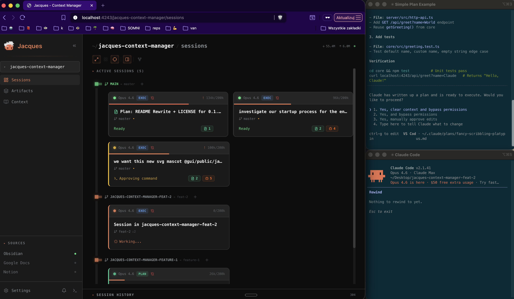
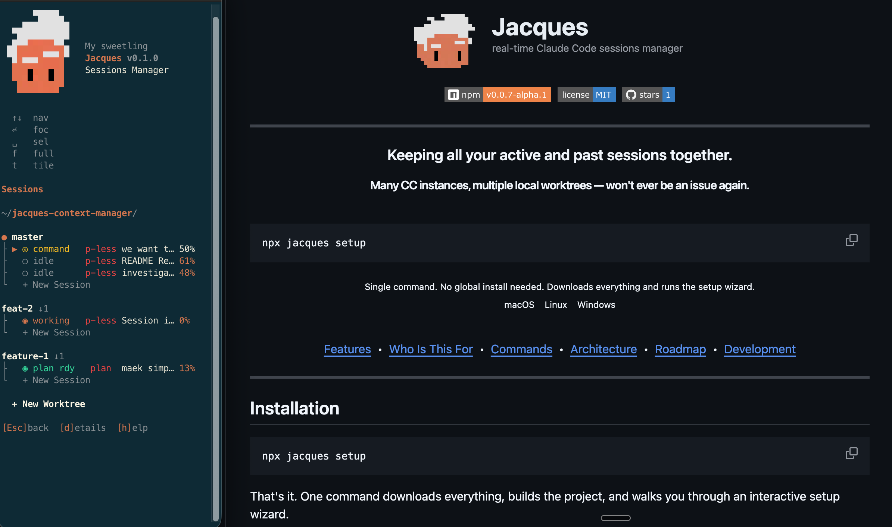
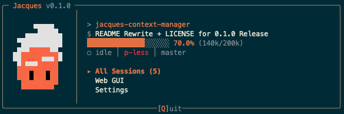
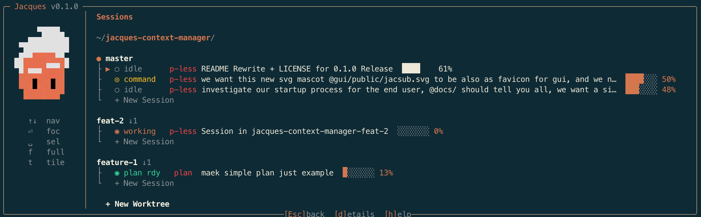
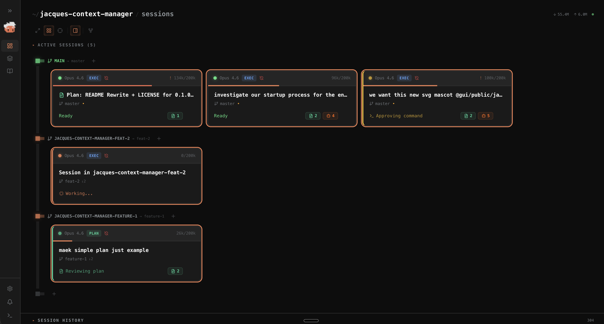
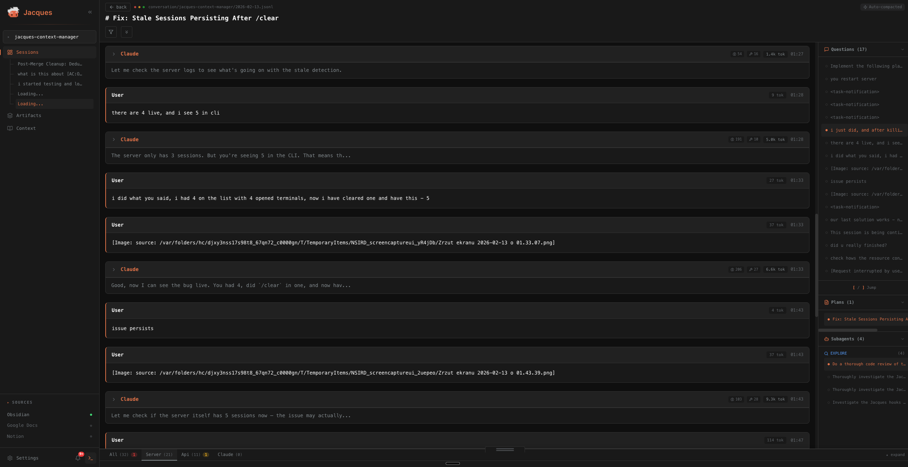
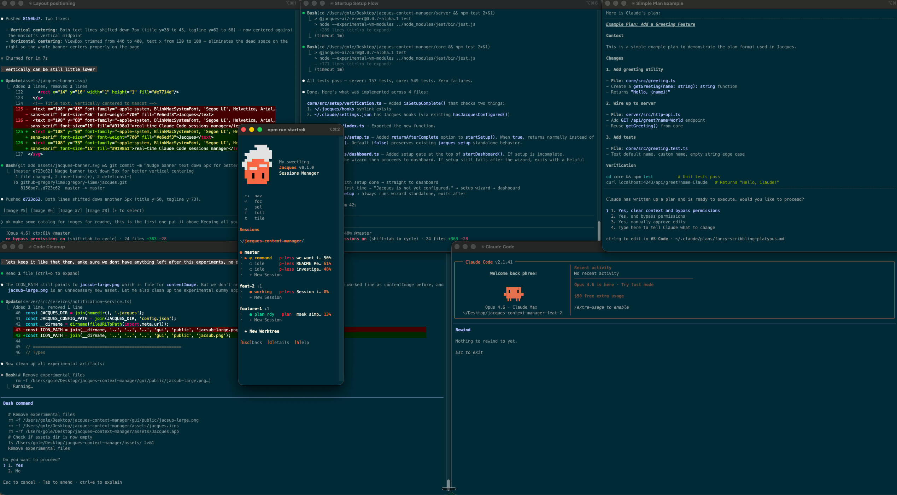

<p align="center">
  
</p>

<p align="center">
  <a href="https://www.npmjs.com/package/@jacques-ai/cli"></a>&nbsp;
  <a href="LICENSE"></a>&nbsp;
  <a href="https://github.com/gregory-lime/jacques/stargazers"></a>
</p>

<p align="center">
  
</p>

---

<h3 align="center">Keeping all your active and past sessions together.</h3>
<p align="center"><strong>Many CC instances, multiple local worktrees — won't ever be an issue again.</strong></p>

<br />

```bash
npx jacques
```

<p align="center">
  <sub>Single command. No global install needed. First run auto-detects missing setup and walks you through it.</sub><br />
  <sub>macOS &nbsp;&nbsp; Linux &nbsp;&nbsp; Windows</sub>
</p>

<br />

<p align="center">
  <a href="#what-you-get">Features</a> &nbsp;&bull;&nbsp;
  <a href="#who-is-this-for">Who Is This For</a> &nbsp;&bull;&nbsp;
  <a href="#commands">Commands</a> &nbsp;&bull;&nbsp;
  <a href="#architecture">Architecture</a> &nbsp;&bull;&nbsp;
  <a href="#roadmap">Roadmap</a> &nbsp;&bull;&nbsp;
  <a href="#development">Development</a>
</p>

---

## Installation

```
npx jacques
```

That's it. First run detects missing setup and launches the interactive wizard automatically. After setup, you go straight to the dashboard.

Need to reconfigure later? Run `npx jacques setup` anytime.

<details>
<summary><strong>Other ways to install</strong></summary>

```bash
# Global install (faster startup after first run)
npm install -g @jacques-ai/cli
jacques

# pnpm
pnpm add -g @jacques-ai/cli
jacques

# bun
bunx jacques
bun add -g @jacques-ai/cli
jacques
```

**`npx` vs global install**: `npx` runs directly without installing — great for trying it out. A global install (`npm i -g`) means `jacques` is always available and starts faster since it skips the download step.

</details>

**Requirements**: Node 20+, Python 3.8+, [Claude Code](https://docs.anthropic.com/en/docs/claude-code).

---

## Known Issues With Working Without Jacques

No more running blind between multiple opened terminals, tabs, worktrees and projects.

Everything available from inside a single app — monitor, focus, tile.

One-click to spawn new Claude Code instances and create new worktrees per task.

Never lose track of unfinished work on the 107th worktree you've created.

<p align="center">
  
</p>

---

## Who Is This For

**Just starting with vibe coding** — feeling overwhelmed with multiple terminal instances, having a hard time keeping good practices with your workflow. Jacques gives you one place to see everything.

**Pre-AI era coders who fully embrace the shift** — but feel the headache with these new dynamic, multi-context workflows and gitflows you have to apply now. Jacques keeps it organized.

**Multiple screens, dozens of agents** — working on different things across different repos. Jacques helps you keep track of all of it.

**13-inch MacBook, single screen** — a single CLI window will help you get the most out of limited space.

<p align="center">
  
</p>

---

## What You Get

Jacques stays simple but powerful. Inside there are a few modules and some additional resources. During the setup process you decide what to install.

### CLI Dashboard

<p align="center">
  
</p>

A terminal TUI that shows real-time context usage %, session status, and plan progress for every active Claude Code session. Keyboard-driven — focus sessions, tile terminal windows into a grid, spawn new sessions, and manage git worktrees without ever leaving the dashboard.

### Web GUI

<p align="center">
  
</p>

Full browser dashboard at `localhost:4243`. Browse session history, view extracted plans and subagent results, manage worktrees, launch sessions. Your entire Claude Code conversation archive — searchable.

<p align="center">
  
</p>

### StatusLine

`[Opus] ctx:42%` displayed right inside Claude Code. No window switching needed — context usage is always visible.

### Skills

`/jacques-handoff` and `/jacques-continue` — structured session handoffs inspired by **ops shift-handoff protocols** (SRE/ITIL). Each handoff captures progress with file paths and function names, user decisions with reasoning, plan status, failed approaches and why, warnings and gotchas, and prioritized next steps — so the next session starts with full context instead of re-discovering everything from scratch.

### Archive & Search

Every session is auto-cataloged on exit — even if you Ctrl+C. Plans, subagent results, and session manifests are extracted and saved. Full-text search across all past conversations, filterable by project, date range, and technology.

---

The setup wizard lets you choose what to enable. Install just the lightweight CLI, add the web GUI for history browsing, or include skills for session continuity.

---

## Roadmap

<p align="center">
  
</p>

The first release was built for a vibeathon organized by [BridgeMind](https://www.bridgemind.ai).

It's early, and it needs improvements. This is a preview of what Jacques will eventually become — your next coding assistant.

More features on the way.

---

## Commands

### CLI

| Command | Description |
|---------|-------------|
| `jacques` | Start dashboard + embedded server |
| `jacques setup` | Interactive setup wizard (re-run anytime to reconfigure) |
| `jacques status` | Show current session status |
| `jacques list` | List active sessions as JSON |
| `jacques search <query>` | Search archived conversations |
| `jacques archive-stats` | Show archive statistics |
| `jacques --version` | Show version |
| `jacques --help` | Show all commands |

**Search options**: `-p/--project`, `--from/--to`, `-t/--tech`, `-l/--limit`, `--json`

### npm scripts

| Script | Description |
|--------|-------------|
| `npm run start:server` | Server + web GUI only |
| `npm run dev:gui` | GUI dev server (hot reload) |
| `npm run build:all` | Rebuild all packages |
| `npm run stop:server` | Stop running server |

---

## Architecture

```
Claude Code (hooks)
    │  IPC Socket (/tmp/jacques.sock)
    ▼
┌─────────────────────────────────┐
│  Jacques Server (Node.js/TS)    │
│  WebSocket :4242 │ HTTP :4243   │
└─────────────────────────────────┘
    │              │
    ▼              ▼
 CLI TUI      Web GUI
(terminal)  (localhost:4243)
```

Claude Code hooks report lifecycle events (start, tool use, idle, context updates) over an IPC socket. The server aggregates state and broadcasts to connected clients. Running `jacques` starts the server, CLI, and web GUI in a single process.

---

## Configuration

| Item | Location |
|------|----------|
| Jacques data | `~/.jacques/` |
| Hook config | `~/.claude/settings.json` |
| Per-project catalog | `{project}/.jacques/` |

**Environment variables** (all optional):

| Variable | Default | Purpose |
|----------|---------|---------|
| `JACQUES_WS_PORT` | `4242` | WebSocket port |
| `JACQUES_HTTP_PORT` | `4243` | HTTP API port |

See [docs/PLATFORM-SUPPORT.md](docs/PLATFORM-SUPPORT.md) for Windows paths and cross-platform details.

---

## Troubleshooting

<details>
<summary><strong>Sessions not appearing</strong></summary>

Restart Claude Code to pick up the new hooks. Verify hooks are installed:

```bash
cat ~/.claude/settings.json | grep jacques
```

If missing, re-run `npx jacques setup`.

</details>

<details>
<summary><strong>Server won't start</strong></summary>

A zombie process may be holding the port:

```bash
npm run stop:server              # Kill zombie process
rm /tmp/jacques.sock             # Remove stale socket (macOS/Linux)
lsof -i :4242 -i :4243          # Check port conflicts
```

</details>

<details>
<summary><strong>StatusLine not showing</strong></summary>

Re-run `npx jacques setup` and make sure StatusLine is enabled in the options step. Restart Claude Code after setup.

</details>

<details>
<summary><strong>CLI shows "Disconnected"</strong></summary>

The server isn't running. Start it with `jacques` or `npm run start:server`.

</details>

For other issues, [open a GitHub issue](https://github.com/gregory-lime/jacques/issues).

---

## FAQ

<details>
<summary><strong>Does Jacques slow down Claude Code?</strong></summary>

No. The hooks are lightweight Python scripts that send a single message over a Unix socket. Overhead is negligible.
</details>

<details>
<summary><strong>Do I need to keep the CLI open?</strong></summary>

No. The StatusLine integration works independently — context % shows inside Claude Code without any external window. The CLI and web GUI are optional views.
</details>

<details>
<summary><strong>Does it work with multiple projects?</strong></summary>

Yes. Jacques discovers all your Claude Code projects automatically and groups sessions by git repo. Switch between projects in the CLI or web GUI.
</details>

<details>
<summary><strong>What happens when a session is killed with Ctrl+C?</strong></summary>

Jacques detects the dead process within 30 seconds and extracts the session's plans, subagent results, and manifest to your project's `.jacques/` directory. Nothing is lost.
</details>

<details>
<summary><strong>Can I use this with Cursor?</strong></summary>

Partial support. Jacques can monitor Cursor sessions but hook integration is still experimental.
</details>

---

## Development

```bash
git clone https://github.com/gregory-lime/jacques.git
cd jacques
npm run setup
```

Build order: `core` → `server` → `cli` → `gui` (each depends on the previous).

```bash
npm run dev:server      # Server with tsc --watch
npm run dev:gui         # GUI with Vite hot reload
npm run build:all       # Full rebuild
```

### Tests

```bash
cd server && npm test       # Server tests
cd core && npm test         # Core tests
cd cli && npm test          # CLI tests
```

See [CLAUDE.md](CLAUDE.md) for the full development guide.

---

## Star History

<a href="https://star-history.com/#gregory-lime/jacques&Date">
  <picture>
    <source media="(prefers-color-scheme: dark)" srcset="https://api.star-history.com/svg?repos=gregory-lime/jacques&type=Date&theme=dark" />
    <source media="(prefers-color-scheme: light)" srcset="https://api.star-history.com/svg?repos=gregory-lime/jacques&type=Date" />
    
  </picture>
</a>

---

## License

[MIT](LICENSE)

---

<p align="center">
  <strong>Built for developers who run Claude Code at scale.</strong>
</p>
